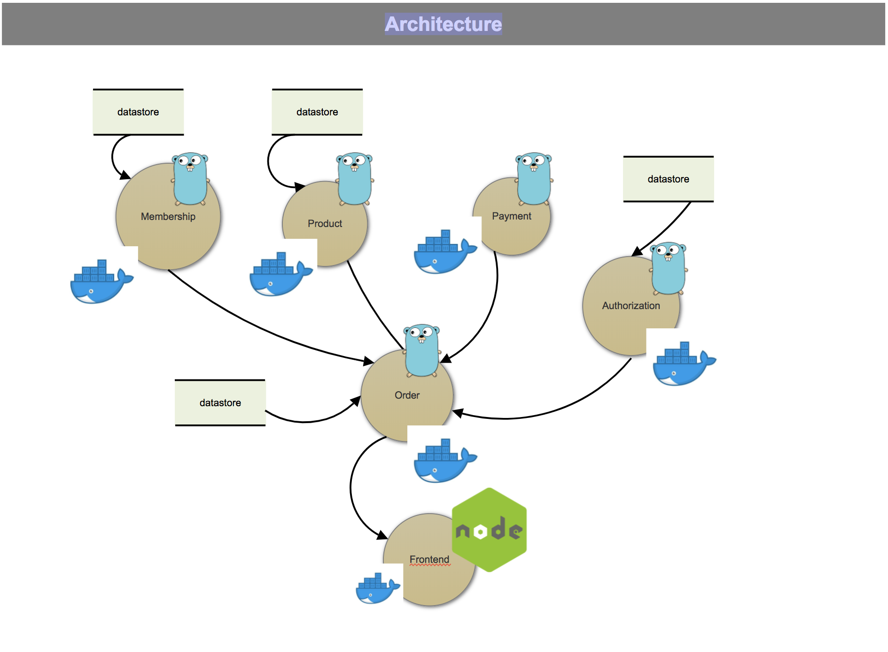

# Mini E-Commerce Build with Go, GRPC, and Microservices Architecture with Multiple Docker Container

[](https://forthebadge.com) [](https://forthebadge.com)

Demo(Building E-Commerce Microservice using Golang, Rest and GRPC)

##



##
### TODO
  - [ ] Create Backend for Product, Order, & Payment
  - [ ] Integrate all backend using GRPC
  - [ ] Create Client (both for Front end web and Mobile app)

### Running
  - Need Docker and Docker Compose on your Machine
  - Run Command

    ```shell
    $ make up
    ```

  - And visit the Front End `http://localhost:3003`

  - Stop Container

    ```shell
    $ make down
    ```
